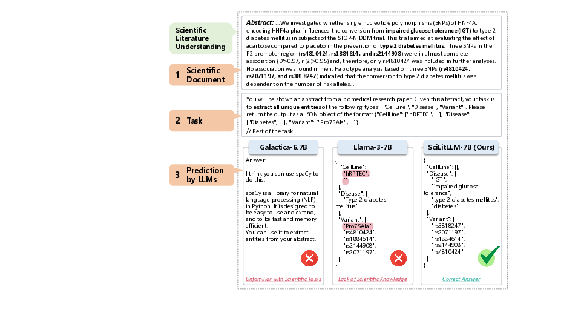
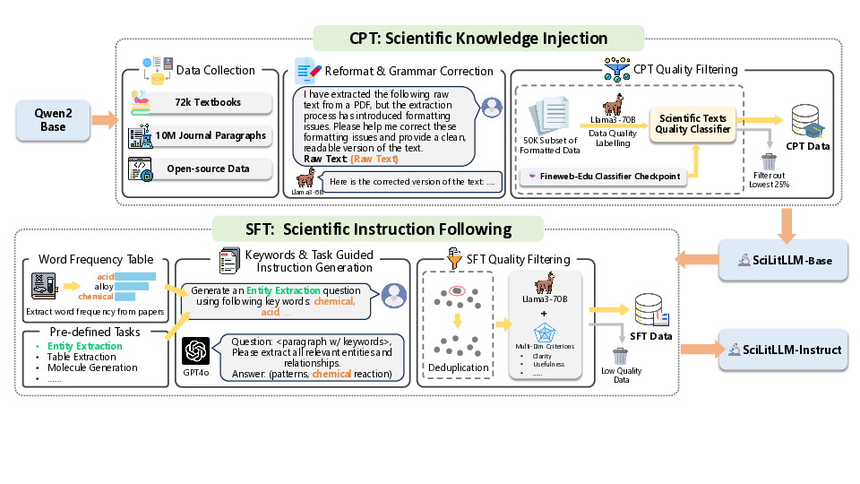

# SciLitLLM: Adapting LLMs for Scientific Literature Understanding

**SciLitLLM** is a framework designed to adapt large language models (LLMs) for effective scientific literature understanding. This repository contains all necessary code for the continual pre-training (CPT) and supervised fine-tuning (SFT) methods, key components of SciLitLLM.

## Overview

Scientific literature understanding is essential for extracting valuable insights and advancing scientific discovery. **SciLitLLM** specializes in this by integrating domain-specific knowledge and task-specific instruction-following abilities. The framework achieves this through:

-**Continual Pre-Training (CPT)**: Infusing domain knowledge from scientific corpora.

-**Supervised Fine-Tuning (SFT)**: Enhancing instruction-following using diverse scientific tasks.

### What is Scientific Literature Understanding?



## SciLitLLM Pipeline

SciLitLLM utilizes a two-stage pipeline:



## Repository Structure

Please refer to each subdirectory for details.

-**cpt/**: Code and data for the continual pre-training process.

-**sft/**: Code and data for supervised fine-tuning on scientific tasks.

## Getting Started

1. Clone the repository and setup environments:

   ```bash

   ```

git clone https://github.com/TODO/SciLitLLM.git

cd SciLitLLM

conda create --name scilitllm python=3.11

conda activate scilitllm

pip install -r requirements.txt

```

2. Follow the instructions in the **cpt/** and **sft/** directories to prepare training corpora.


## Model Performance


SciLitLLM demonstrates significant improvements on scientific literature understanding benchmarks:

-**SciLitLLM-7B**: +3.6% on SciAssess, +10.1% on SciRIFF compared to leading LLMs under 15B parameters.

-**SciLitLLM-72B (QLora)**: +1.7% on SciAssess, +0.8% on SciRIFF among LLMs with ~70B parameters. Our model is 4-bit quantized while other LLMs are of full precision (16 bit).


## Citation


If you find our pipeline and data useful, please kindly cite:


```

@article{TODO}

```

```
