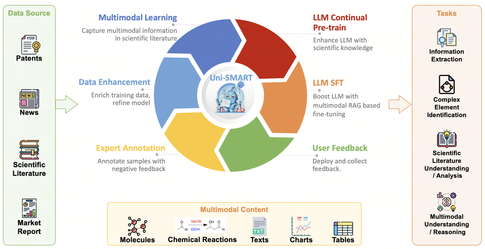
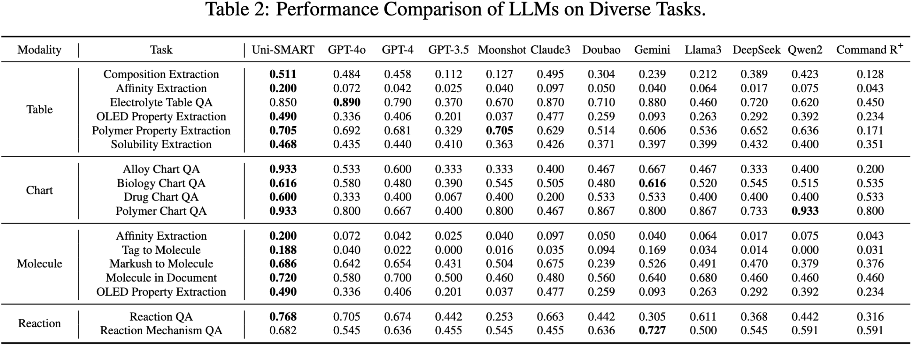

# Uni-SMART

<p align="center">
 📄<a href="https://uni-smart.dp.tech/" target="_blank"> Report </a> • 🤗 <a href="https://huggingface.co/papers/2403.10301" target="_blank">HF Repo</a>
</p>
<p align="center">
<b>Try the latest version of Uni-SMART on <a href="https://uni-finder.dp.tech/">Uni-Finder</a>
</p>



## Update

- 🔥 News: ``2024/08/26``: We have released the weights of [Uni-SMART/SciLit-LLM-7B](https://huggingface.co/Uni-SMART/SciLitLLM), and disclosed the [Arxiv paper](https://arxiv.org/pdf/2408.15545).

## Introduction

Uni-SMART uses a wide range of scientific literature data sources, including patents, scientific publications, news articles, market reports, and more. It also employs an active learning approach to continuously enhance the model's capabilities:

1. Multimodal Learning

   In the initial stage, the parsing model is trained using a small amount of multimodal data to identify and extract various information elements from scientific literature. The output is in a customized format expressed in text form, similar to markdown/latex/html formats, which can effectively represent various multimodal element information.
2. [Continue pre-training of LLM](./SciLitLLM/cpt/)

   Collect high-quality data in the scientific field (such as textbooks, journals, etc.), use multimodal parsing models to analyze this data, and send the parsed data into LLM for continue pre-training to enhance the domain knowledge of LLM.
3. [Large Model Supervised Fine-Tuning (LLM SFT)](./SciLitLLM/sft/)

   Construct a series of valuable queries for multimodal scenarios, using the Multimodal RAG approach to recall corresponding content from literature based on the queries, ensuring better retrieval of relevant multimodal information; construct answers based on the queries and retrieved content, and use query-answer data to perform Supervised Fine-Tuning on the LLM, enabling it to adapt to this custom input format while also improving its instruction-following ability.
4. User Feedback

   After deploying the large model enhanced by SFT into practical applications, we collected feedback from internal users who explicitly gave their consent. Samples with positive feedback will be filtered and subsequently enter the data augmentation phase, while samples with negative feedback will need to be annotated by experts before entering the data augmentation phase.
5. Expert Annotation

   Samples that receive negative feedback will be meticulously annotated by internal domain experts to ensure that the model can learn and improve from these errors. Semi-automated tools will assist in this process to enhance annotation efficiency. Cases of negative feedback are typically divided into the following categories:

   - Multimodal element recognition error.
   - Recall content error.
   - Domain knowledge error.
   - Poor instruction adherence.
   
   Through detailed analysis of error types, promote more targeted improvements.
6. Data Enhancement and Model Optimization
   Finally, the data annotated by experts, along with some positive feedback samples, are added to the model's training data to continuously expand the dataset. At the same time, optimize the pipeline based on different negative feedback cases from expert annotations.

   - Multimodal element recognition errors: Expand the training data for the parsing model, especially samples of parsing errors.
   - Recall content error: Optimize Multimodal RAG plan.
   - Domain knowledge error: Reinforcement continue pre-train.
   - Poor instruction adherence: Expand the training data for LLM SFT.

   Continuously repeat this iterative process to optimize the overall performance of Uni-SMART.

This iterative pipeline significantly enhances Uni-SMART's performance in various tasks, such as information extraction, complex element recognition, scientific literature understanding and analysis, as well as the understanding and reasoning of multimodal elements.

## Evaluation


## Uni-SMART Series Models

| Model | Type | Seq Length | Download |
| :---: | :---: | :---: | :---: |
| UniSMART/SciLit-LLM-7B | Base | 128K | [🤗 Huggingface](https://huggingface.co/Uni-SMART/SciLitLLM) |

## Project List

If you would like to learn more about the details of training data construction for the Uni-SMART family of open source models for Continue PreTraining and related Supervised Finetuning, you can refer to the following resources

+ [Continual PreTraining](SciliLLM/cpt/README.md): This includes the data construction method for Uni-SMART/SciLit-LLM Continual PreTraining.
+ [Supervised Fine-Tuning](SciLitLLM/sft/README.md): This includes the SFT data construction method for the Uni-SMART series models.

## Community

Programs based on Uni-SMART/SciLit-LLM 🔥🔥🔥 Continuously updating

## Friendly Links

+ [SciAssess](https://github.com/sci-assess/SciAssess): A Benchmark for Evaluating Large Language Models in Scientific Literature Analysis.
+ [LLaMA-Factory](https://github.com/hiyouga/LLaMA-Factory): Efficient open-source fine-tuning framework that supports fine-tuning of the Uni-SMART series models.

## Citation

Please consider citing the following papers if you find our work helpful.

```
@misc{cai2024unismartuniversalsciencemultimodal,
      title={Uni-SMART: Universal Science Multimodal Analysis and Research Transformer}, 
      author={Hengxing Cai and Xiaochen Cai and Shuwen Yang and Jiankun Wang and Lin Yao and Zhifeng Gao and Junhan Chang and Sihang Li and Mingjun Xu and Changxin Wang and Hongshuai Wang and Yongge Li and Mujie Lin and Yaqi Li and Yuqi Yin and Linfeng Zhang and Guolin Ke},
      year={2024},
      eprint={2403.10301},
      archivePrefix={arXiv},
      primaryClass={cs.CL},
      url={https://arxiv.org/abs/2403.10301}, 
}
```