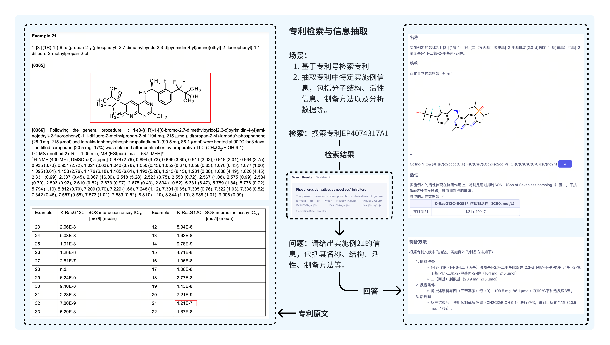
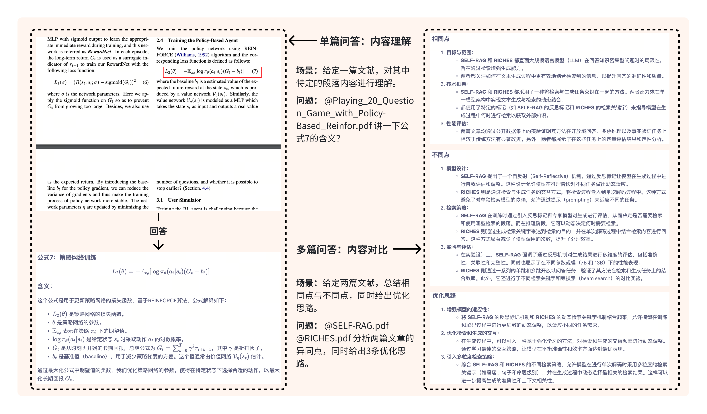
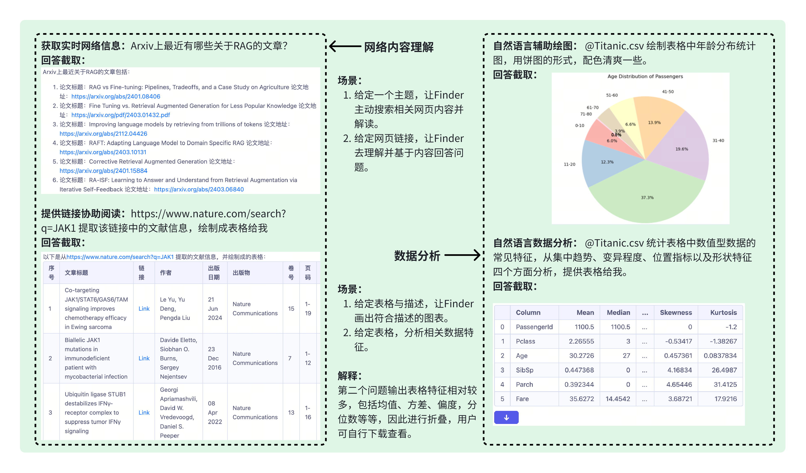

# Uni-SMART

 📄<a href="https://arxiv.org/" target="_blank"> Paper </a> • 🤗 <a href="https://huggingface.co/papers/2403.10301" target="_blank">HF Repo</a>

<b>在<a href="https://uni-finder.dp.tech/">Uni-Finder</a>上体验最新版本Uni-SMART

******************[[English](README.md) | 中文]****************
**

## ****************项目更新****************

- ****************🔥 **News**: ``2024/08/26``: 我们公开了开源了Uni-SMART/SciLit-LLM-7B的权重[权重链接](https://huggingface.co/Uni-SMART/SciLitLLM)，并公开了的技术细节[论文链接](https://arxiv.org/pdf/2408.15545)。****************

## ****************模型介绍****************

****************Uni-SMART使用了广泛的科学文献数据源，包括专利、科学出版物、新闻文章、市场报告等。并采用了主动学习 (Active learning)的方法来不断增强模型的能力：****************

1. ****************多模态学习 (Multimodal Learning)：在初始阶段，解析模型通过较少的多模态数据进行训练，以识别和提取科学文献中的各种信息元素，输出是一种自定义的格式，以文本形式表达，类似markdown/latex/html格式，可以很好地表达各种多模态的元素信息。****************
2. ****************LLM的continue pre-train：收集科学领域的高质量数据（如教科书、期刊等），使用多模态解析模型对这些数据进行解析，解析后的数据送入LLM进行continue pre-train，以增强LLM的领域知识。****************
3. ****************大模型有监督微调 (LLM SFT)：针对多模态场景构造一系列有价值的query，使用Multimodal RAG方案，根据query从文献中召回对应的内容，确保更好地检索到对应的多模态信息；根据query和检索到的内容构造answer，使用query-answer数据对LLM进行Supervised Fine-Tuning，使LLM适应这种自定义的输入格式，同时有更好的指令遵循能力。****************
4. ****************用户反馈 (User Feedback)：经过SFT增强的大模型部署到实际应用中，期间，我们从明确给予同意的内部用户中收集反馈。收到正反馈的样本将被筛选并随后进入数据增强环节，而收到负反馈的样本则需经过专家标注后进入到数据增强环节中。****************
5. ****************专家标注 (Expert Annotation)：获得负反馈的样本会由内部的领域专家进行细致的标注，确保模型能够从这些错误中学习并改进，半自动化工具将在这个过程中提供帮助以提高标注效率。负反馈的案例通常分为以下几类：
   (1) 多模态元素识别错误；
   (2) 召回内容错误；
   (3) 领域知识错误；
   (4) 指令遵循不佳；
   通过细致的错误类型分析，从而促进更有针对性的改进。****************
6. ****************数据增强 (Data Enhancement)和模型优化：最后，将专家标注后的数据，以及部分正反馈的样本增加到模型的训练数据中，实现数据集的不断扩充。同时，根据专家标注中不同的负反馈案例，优化pipeline。
   (1) 多模态元素识别错误：扩充解析模型的训练数据，尤其是解析错误的样本；
   (2) 召回内容错误：优化Multimodal RAG方案；
   (3) 领域知识错误：强化continue pre-train；
   (4) 指令遵循不佳：扩充LLM SFT的训练数据；
   不断重复这一迭代过程，以此来优化Uni-SMART的整体性能。****************

****************这种循环迭代的流水线显著提升了Uni-SMART在各种任务中的表现，如信息提取、复杂元素识别、科学文献理解和分析，以及多模态元素的理解和推理等。****************

## ****************项目列表****************

****************如果你想更进一步了解 Uni-SMART 系列开源模型的Continue PreTraining和相关Supervised Finetuning的训练数据构造细节，可以参考以下资源****************

+ ****************[Continual PreTraining](cpt/README.md): 在这里包含了Uni-SMART/SciLit-LLM Continual PreTraining数据构造方法。****************
+ ****************[Supervised Fine-Tuning](sft/README.md): 在这里包含了Uni-SMART系列模型 SFT 数据构造方法。****************

## ****************社区****************

******************基于Uni-SMART/SciLit-LLM延伸的项目列表🔥🔥🔥持续更新******************

| Program | Description |
| :-----: | :---------: |
|    -    |      -      |

## ****************友情链接****************

+ ****************[SciAssess](https://github.com/sci-assess/SciAssess): 评估科学文献分析中大型语言模型的基准。****************
+ ****************[LLaMA-Factory](https://github.com/hiyouga/LLaMA-Factory): 高效开源微调框架，支持对Uni-SMART系列语言模型微调。****************

## ****************Uni-Finder：Uni-SMART驱动的科学文献研读平台****************

****************`<a href="https://uni-finder.dp.tech/">`Uni-Finder试用链接 `</a>`

****************

## ****************协议****************

## ****************引用****************

****************如果你觉得我们的工作有帮助的话，请考虑引用下列论文。****************
