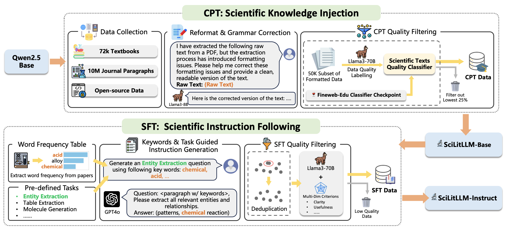

# SciLitLLM: Adapting LLMs for Scientific Literature Understanding

**SciLitLLM** adapts a general large language model for effective scientific literature understanding. This repository contains all necessary code for the continual pre-training (CPT) and supervised fine-tuning (SFT) methods, which are key components of SciLitLLM.

## ****Update****

- 🔥 **News**: ``2024/10/14``: **We have released SciLitLLM-1.5 (7B and 14B) and [SciLitIns](https://huggingface.co/datasets/Uni-SMART/SciLitIns)!**
- ****🔥 **News**: ``2024/08/26``: We have released the weights of SciLit-LLM-7B, and disclosed the [Arxiv paper](https://arxiv.org/pdf/2408.15545).****

## **Model List**

|             Model             |    Type    | Seq Length |                                                 Download                                                 |
| :---------------------------: | :---------: | :--------: | :-------------------------------------------------------------------------------------------------------: |
| UniSMART/SciLitLLM-1.5-7B/14B | Instruction |    128K    | [🤗 ](https://huggingface.co/Uni-SMART/SciLitLLM)[Huggingface](https://huggingface.co/Uni-SMART/SciLitLLM-1.5) |
|     UniSMART/SciLitLLM-7B     | Instruction |    128K    |                         [🤗 Huggingface](https://huggingface.co/Uni-SMART/SciLitLLM)                         |

## Overview

Scientific literature understanding is essential for extracting valuable insights and advancing scientific discovery. **SciLitLLM** specializes in this by integrating domain-specific knowledge and task-specific instruction-following abilities. The framework achieves this through:

-**Continual Pre-Training (CPT)**: Infusing domain knowledge from scientific corpora.

-**Supervised Fine-Tuning (SFT)**: Enhancing instruction-following using diverse scientific tasks.

### What is Scientific Literature Understanding?


## Evaluation results


To reproduce the baselines, you can refer to [SciRIFF_SciLitLLMs](https://github.com/Jn-Huang/SciRIFF_SciLitLLMs) and [SciAssess](https://github.com/sci-assess/SciAssess).

## SciLitLLM Pipeline

SciLitLLM utilizes a two-stage pipeline:



## Repository Structure

Please refer to each subdirectory for details.

-**cpt/**: data processing codes for CPT corpura.

-**sft/**: data processing codes for SFT instructions.

## Create Your Domian-specific Model

1. Clone the repository and setup environments:

   ```bash
   git clone https://github.com/dptech-corp/Uni-SMART.git

   cd Uni-SMART/SciLitLLM

   conda create --name scilitllm python=3.10

   conda activate scilitllm

   pip install -r requirements.txt
   ```
2. Follow the instructions in the **cpt/** and **sft/** directories to prepare training corpora.

## ****Citation****

****Please consider citing the following papers if you find our work helpful.****

```
@misc{li2024scilitllmadaptllmsscientific,
      title={SciLitLLM: How to Adapt LLMs for Scientific Literature Understanding}, 
      author={Sihang Li and Jin Huang and Jiaxi Zhuang and Yaorui Shi and Xiaochen Cai and Mingjun Xu and Xiang Wang and Linfeng Zhang and Guolin Ke and Hengxing Cai},
      year={2024},
      eprint={2408.15545},
      archivePrefix={arXiv},
      primaryClass={cs.LG},
      url={https://arxiv.org/abs/2408.15545}, 
}
```
